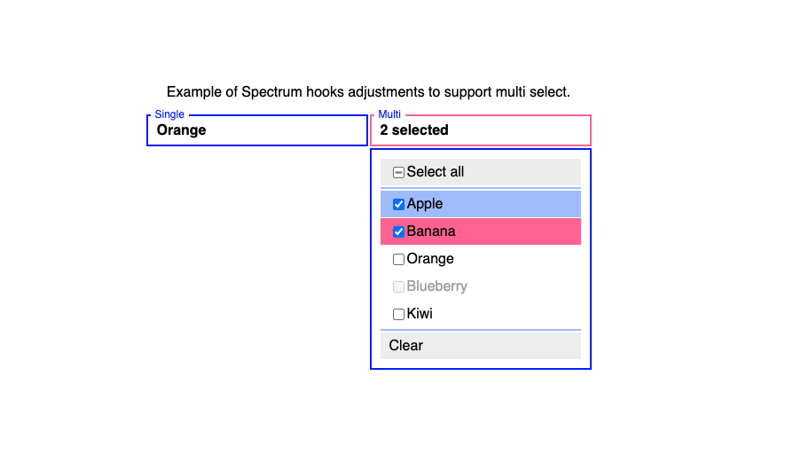

# react-aria-multiselect



Developer usage:

- `$ pnpm install`
- `$ pnpm start`
- `$ open -a safari --url "http://localhost:3000"`

Based on a codesandbox by Roman Veselý (crazko):

- https://github.com/adobe/react-spectrum/issues/2140#issuecomment-1013452232
- https://codesandbox.io/s/spectrum-multiselect-9be866-9be866

Compatible with React Spectrum release from 16 December 2022.

- https://react-spectrum.adobe.com/releases/2022-12-16.html

This code is incompatible with `React.Strict`. Work-around: Remove react strict-mode.

- work-around: https://github.com/adobe/react-spectrum/issues/3515
- fixed in: https://github.com/adobe/react-spectrum/pull/3878
- also fixed in: https://github.com/adobe/react-spectrum/pull/3865

Lines of code per source file:

```
❯ wc -l $(find src -type f)
      12 src/index.tsx
      80 src/App.tsx
      62 src/styles.css
     201 src/select.css
     110 src/Select/SelectListBox.tsx
      79 src/Select/SelectPopover.tsx
     213 src/Select/useMultiSelect.ts
      69 src/Select/useMultiSelectListState.ts
      94 src/Select/useMultiSelectState.ts
     258 src/Select/Select.tsx
       1 src/react-app-env.d.ts
    1179 total
```
